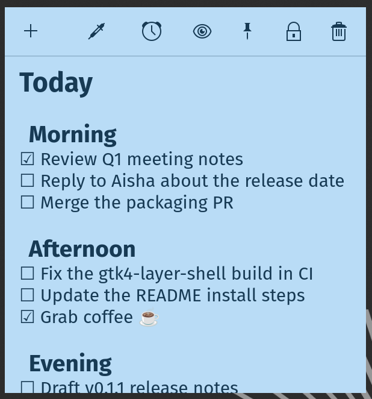
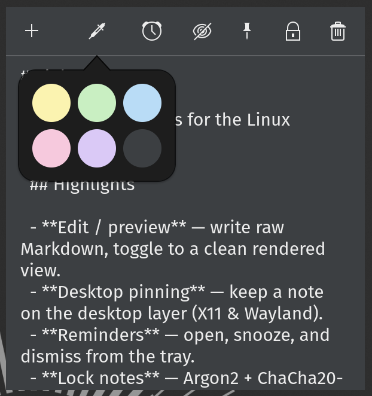
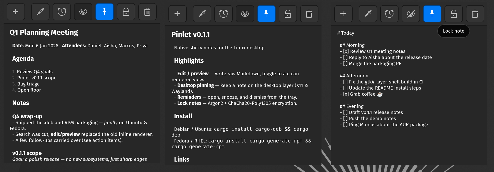
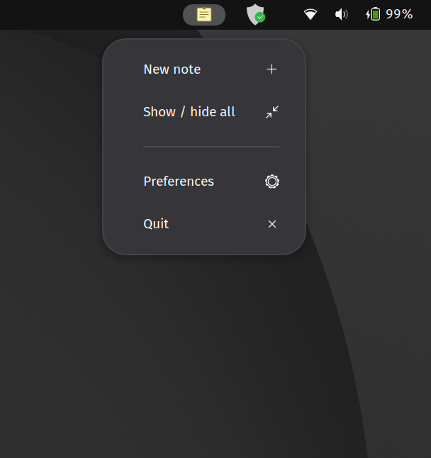

# Pinlet

Native sticky notes for the Linux desktop. Every note is a plain Markdown
file with YAML frontmatter plus body & inside a git repository you fully own, so
your notes are portable, diffable, and never locked into a proprietary format.

## Screenshots

| | |
| --- | --- |
|  |  |
|  |  |

## Features

- **Markdown notes** with a live edit/preview toggle, interactive checklists,
  and six color themes.
- **Reminders** with desktop notifications (open, snooze, dismiss) and an
  upcoming-reminders list in the system tray.
- **Desktop pinning** — pin a note so it sits on the desktop layer, above the
  wallpaper and below your windows (X11/XWayland and wlr-layer-shell).
- **Lock notes** with encryption (Argon2 key derivation + ChaCha20-Poly1305).
- **System tray** with quick actions and the next few upcoming reminders.
- **Global shortcut** to capture a note from anywhere.
- **Git-backed** — the note directory is a git repository with auto-commit and
  push/pull sync, so every change is versioned, diffable, and shareable across
  machines.
- **Dark-mode aware**, built on GTK4 + libadwaita.

## How notes are stored

Notes live in `~/.local/share/pinlet/` (print the path with `pinlet where`).
Each note is one Markdown file whose frontmatter carries its metadata:

```markdown
---
id: 3f2f79c1-0e1e-4d2b-9c12-1a2b3c4d5e6f
title: Groceries
color: Yellow
is_pinned_to_desktop: false
reminders: []
---

- [ ] Q1 review meeting at 10
- [x] Prepare for Q1 BI presentation
```

The directory is a git repository that auto-commits your changes (coalesced,
after an idle delay, on lock, and on quit). Locked notes are encrypted and
stored git-ignored in `locked/`, so they never sync.

## Install

Pinlet is packaged for **Debian/Ubuntu**, **Fedora/RHEL/openSUSE**, and
**Arch Linux (AUR)**.

### Prebuilt packages (recommended)

Download the latest release from
[GitHub Releases](https://github.com/dan-kimani/pinlet/releases). Each release
attaches Debian (`.deb`) and RPM (`.rpm`) packages plus the raw `pinlet`
binary.

### Build from source

```bash
cargo build --release
./target/release/pinlet
```

### Debian package

```bash
cargo install cargo-deb
cargo deb
```

The package installs the `pinlet` binary, a launcher entry (so Pinlet is
searchable from the application menu), the app icon, and metadata. Its
post-install script pre-creates `~/.local/share/pinlet` and `git init`s it for
the installing user; the app also does this on first launch.

### RPM (Fedora, RHEL, openSUSE)

```bash
cargo install cargo-generate-rpm
cargo generate-rpm
```

Mirrors the Debian package — binary, launcher entry, icon, and metadata, with
the same install-time setup script. Shared-library dependencies (GTK, libadwaita)
are detected automatically; `git` is declared explicitly.

### Arch (AUR)

```bash
cd arch
makepkg -si
```

The [`arch/PKGBUILD`](arch/PKGBUILD) builds from source (a `-git` package ready
for the AUR). The app creates its data directory and git repository on first
launch.

## Local development

Building from source requires a Rust toolchain ([rustup](https://rustup.rs))
plus the GTK4 development libraries:

| Distribution    | Packages                                                             |
| --------------- | -------------------------------------------------------------------- |
| Debian / Ubuntu | `libgtk-4-dev libadwaita-1-dev libgtk4-layer-shell-dev pkg-config`   |
| Fedora / RHEL   | `gtk4-devel libadwaita-devel gtk4-layer-shell-devel`                 |
| Arch            | `gtk4 libadwaita gtk4-layer-shell`                                   |

Then `cargo build --release` (see [Build from source](#build-from-source)).

If your distribution doesn't ship `gtk4-layer-shell`, build and install it
locally from source — see the
[gtk4-layer-shell](https://github.com/wmww/gtk4-layer-shell) repository.

## Usage

| Command                                        | What it does                    |
| ---------------------------------------------- | ------------------------------- |
| `pinlet`                                       | Open all your notes             |
| `pinlet new "V2 patch release notes"`          | Create a note with initial text |
| `pinlet new "PR review comments" --color blue` | Create a blue note              |
| `pinlet where`                                 | Print the note repository path  |

## License

[MIT](LICENSE)
